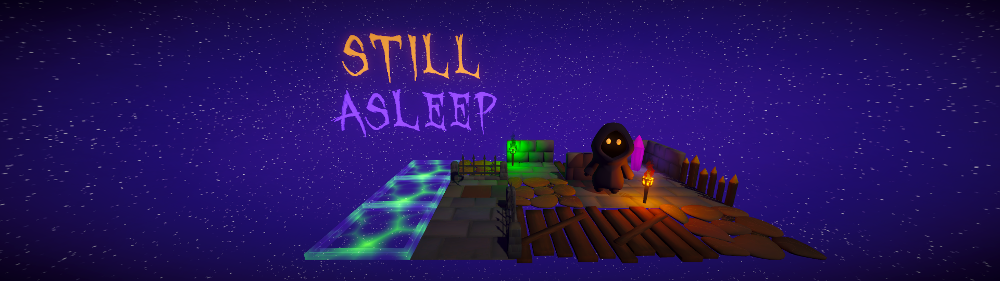

# Still Asleep
> Wake up…  
> You are trapped in a fracturing nightmare, endlessly chasing a glowing white figure, your true self. The world around you is a dissolving grid that shifts, collapses, and rewrites itself with every step you take.  
> To survive the void, you cannot just run, you must create.  
> In this puzzle-runner, you are the architect of your own escape. Harvest scattered energy to materialize floor tiles, deploy jump pads and bridge the gaps in reality before they swallow you whole.  
> Will you be consumed by the chaos, or can you build a path fast enough to catch your soul?

*Still Asleep* is a puzzle-runner in which the player must chase and catch their own soul within an ever-changing, chaotic maze. Reuniting the fractured self on foot alone often comes to no avail as the soul will hover away as far away as it can as quickly as it can.  
Instead, the player may change the maze through placing tiles and manipulating the *Wave Function Collapse*-powered world generation to their advantage.

The game is being developed over the 2025/2026 *Computer Games* course at the University of Tübingen.  

As of February 2026, we have released our first public, playable game demo!  
Look [further below](#running-the-game) for instructions on how to run our game.

Enjoy! :)

## Table of Contents
1. [The Game](#the-game)
2. [Running the Game](#running-the-game)
3. [Bugs, Help & Contact](#bugs-help--contact)
4. [The Team](#the-team)
5. [License](#license)

## The Game
*Still Asleep*, formerly called *Escape Exit*, is a project made for the *Computer Games* practical course at the University of Tübingen over the 2025/2026 winter semester.

The central theme of this game jam-esque course has been *Tamed Growth*, which we have implemented through our grid system. The grid itself keeps growing on its own through the means of our Wave Function Collapse algorithm implementation. As the ghost-like figure moves through the map, the player can tame this chaotic growth through strategically placing tiles in order to block off the soul's movement to catch it.

## Running the Game
To play the game, download the latest release from our [GitHub repository](https://github.com/Muffleee/StillAsleep/releases/).
Once downloaded, extract `StillAsleep.zip`, open the resulting folder, and run the `StillAsleep.exe` executable within.

## Bugs, Help & Contact
If you come across any issues with this game, or if you'd like to ask us something, please reach out to us! You can do so by [raising an issue](https://github.com/Muffleee/StillAsleep/issues/new/choose) in the game's GitHub repository.  
We'd very much appreciate it if you gave as much detail as you can (e.g. reproduction stept) to help us help you :)

## The Team
- [Ahmet B.](https://github.com/zxocn62)
- [Anas B.](https://github.com/AnasMB7)
- [Mehmet K.](https://github.com/Babachu38)
- [Nagipha S.](https://github.com/Nagiphaaa)
- [Samira F.](https://github.com/Lucida22)
- [Steven S.](https://github.com/Muffleee)
- [Vanessa F.](https://github.com/justvane)

## License
As we have not decided on a specific license, the contents of this repository are only subject to the [GitHub Terms of Service](https://docs.github.com/site-policy/github-terms/github-terms-of-service).  
All rights reserved.

---

###### last updated 09/02/2026
