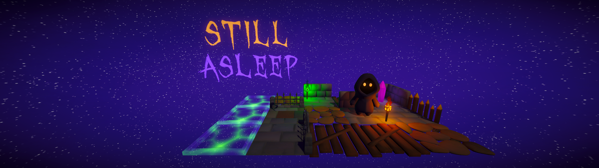
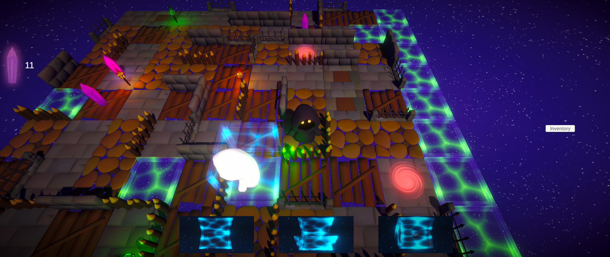
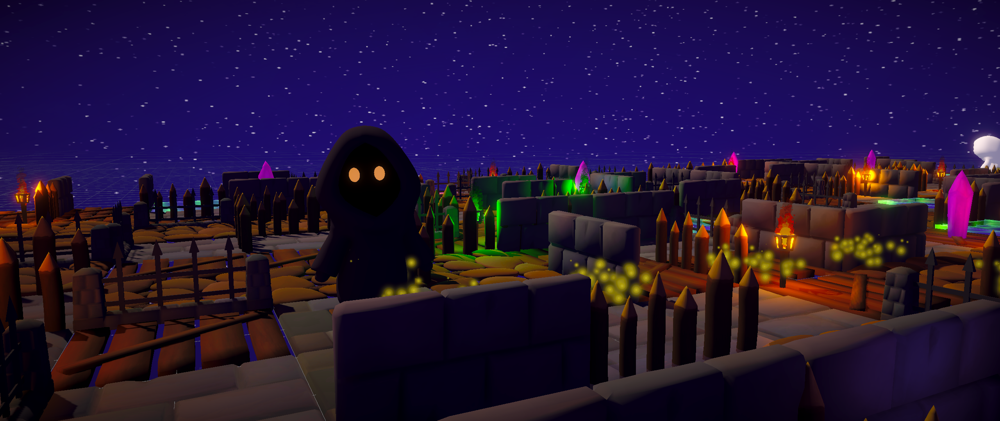

# Still Asleep
> Wake up…
>
> You are trapped in a fracturing nightmare, endlessly chasing a glowing white figure, your true self. The world around you is a dissolving grid that shifts, collapses, and rewrites itself with every step you take.  
> To survive the void, you cannot just run, you must create.
>
> In this puzzle-runner, you are the architect of your own escape. Harvest scattered energy to materialize floor tiles, deploy jump pads and bridge the gaps in reality before they swallow you whole.  
> Will you be consumed by the chaos, or can you build a path fast enough to catch your soul?

*Still Asleep* is a turn-based puzzle-runner in which the player must chase and catch their own soul within an ever-changing, chaotic maze. Reuniting the fractured self on foot alone often comes to no avail as the soul will hover away as far away as it can as quickly as it can.  
Instead, the player may change the maze through placing tiles and manipulating the *Wave Function Collapse*-powered world generation to their advantage.

The game is being developed over the 2025/2026 *Computer Games* course at the University of Tübingen.  

As of February 2026, we have released our first public, playable game demo!  
Look [further below](#running-the-game) for instructions on how to run our game.

Enjoy! :)

## Table of Contents
1. [The Game](#the-game)
2. [Gameplay](#gameplay)  
    2.1. [Energy Management](#energy-management)  
    2.2. [Tiles](#tiles)  
    2.3. [Items](#items)  
    2.4. [Map Conditions](#map-conditions)
3. [Running the Game](#running-the-game)
4. [Bugs, Help & Contact](#bugs-help--contact)
5. [The Team](#the-team)
6. [License](#license)

## The Game
*Still Asleep*, formerly called *Escape Exit*, is a project made for the *Computer Games* practical course at the University of Tübingen over the 2025/2026 winter semester.

The central theme of this game jam-esque course has been *Tamed Growth*, which we have implemented through our grid system. The grid itself keeps growing on its own through the means of our Wave Function Collapse algorithm implementation. As the ghost-like figure moves through the map, the player can tame this chaotic growth through strategically placing tiles in order to block off the soul's movement to catch it.

## Gameplay
Avoid traps, manage your energy crystals, jump over walls using jumping pads, and corner in your soul by strategically placing tiles to reunite yourself.

Lost? If all seems hopeless and your soul got too far away, a trail nudges you into the right direction.

### Energy Management
Over the course of the game, you will have to learn to manage your energy. Gain energy by picking up crystals strewn across the map, and use it for placing tiles, using jumping pads, using items, or paying the penalty of hitting a trap.

### Tiles
The map you will be traversing consists of various tiles which each can have walls at any of its four sides. There are a few special tiles which you should watch out for — they can work to your advantage, or endager your run.

**Jumping Pad**  
The Jumping Pads occasionally strewn across the map may help you get to your destination as quickly as possible as they enable you to jump across any wall at that specific tile, just as long as you have enough energy.

**Rotating Tile**  
The Rotating Tile changes the map's available paths dynamically every single turn as it rotates the wall around it. Make sure you know where you're going!

**Ice**  
Ice Tiles stop you from turning; instead, you will just slide across. Watch out for any potential dangers coming after the tile!

**Trap**  
Many Traps across the map pose as one type of hazards for the player. Step on the red vortex and get sucked in, and lose some energy. If you had no energy to begin with, bad luck — you lost.

**Hidden Trap**
Hidden Traps are an invisible variant of the regular Traps, though they consume less energy if passed. Use the Scanner item to make sure you don't accidentally walk into these.

**Spikes**
Spikes are the second, more dangerous hazard on the map. They appear and disappear every few turns, walk on them and your run is over.

### Items
Any regular tile on the map can spawn with an item on top. Pick them up and use them strategically; they may help you succeed.

**Pickaxe**  
The Pickaxe allows you to break any wall of the tile you're currently on, just face a wall and swing!

**Scanner**  
Using the scanner leads to any hidden trap around the player being revealed and turned into a regular trap.

**Time Reversal Module**  
Screwed up some moves? Your soul got too far away for your liking? The Time Reversal Module can revert a few of the soul's steps and helps you get closer.

**Sticky Trap**  
A Sticky Trap can stop all movement of your soul for a few turns, use it wisely and maybe you can put yourself together!

### Map Conditions
Every few rounds, a random Map Condition gets chosen and mixes up the game. Stay on your toes and make sure you don't lose to the additional challenges, which get even more difficult the longer the game last.

**Countdown**  
During some game phases, the Countdown Map Condition limits the time you have to make a move. Make quick decisions or it's game over.

**Fog of War**  
In other rounds, a Fog of War can obstruct your vision and hinder you from proceeding towards your goal. Make sure you don't lose sight of your soul, otherwise good luck.

**The Enemy**  
The Enemy, a giant spike ball, can occasionally spawn and relentlessly pursue the player. If you get hit, it's game over.

### Controls
| Key           | Function                |
| ------------- | ----------------------- |
| W/A/S/D       | Move up/left/down/right |
| Drag & Drop   | Place tile              |
| E             | Pick up item            |
| Scroll        | Select item             |
| F             | Use selected item       |
| Number keys   | Use item in number slot |
| Q             | Drop selected item      |
| Ctrl + Scroll | Zoom                    |

## Running the Game
To play the game, download the latest release from our [GitHub repository](https://github.com/Muffleee/StillAsleep/releases/).
Once downloaded, extract `StillAsleep.zip`, open the resulting folder, and run the `StillAsleep.exe` executable within.

## Bugs, Help & Contact
If you come across any issues with this game, or if you'd like to ask us something, please reach out to us! You can do so by [raising an issue](https://github.com/Muffleee/StillAsleep/issues/new/choose) in the game's GitHub repository.  
We'd very much appreciate it if you gave as much detail as you can (e.g. reproduction steps) to help us help you :)

## The Team
- [Ahmet B.](https://github.com/zxocn62)
- [Anas B.](https://github.com/AnasMB7)
- [Mehmet K.](https://github.com/Babachu38)
- [Nagipha S.](https://github.com/Nagiphaaa)
- [Samira F.](https://github.com/Lucida22)
- [Steven S.](https://github.com/Muffleee)
- ([Vanessa F.](https://github.com/justvane))

## License
As we have not decided on a specific license, the contents of this repository are only subject to the [GitHub Terms of Service](https://docs.github.com/site-policy/github-terms/github-terms-of-service).  
All rights reserved.

---

###### last updated 10/02/2026
